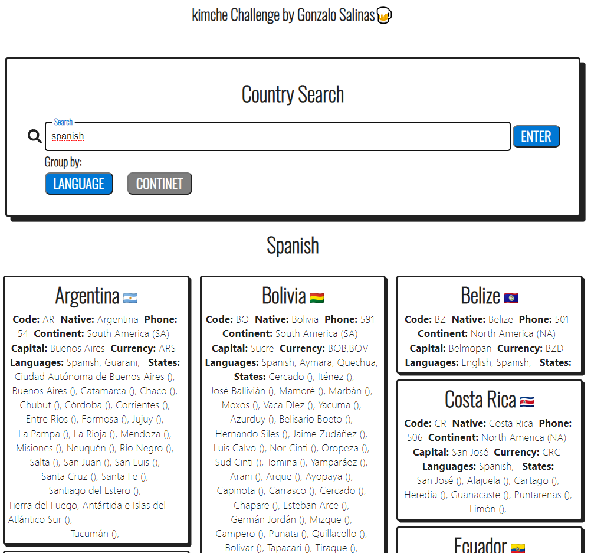
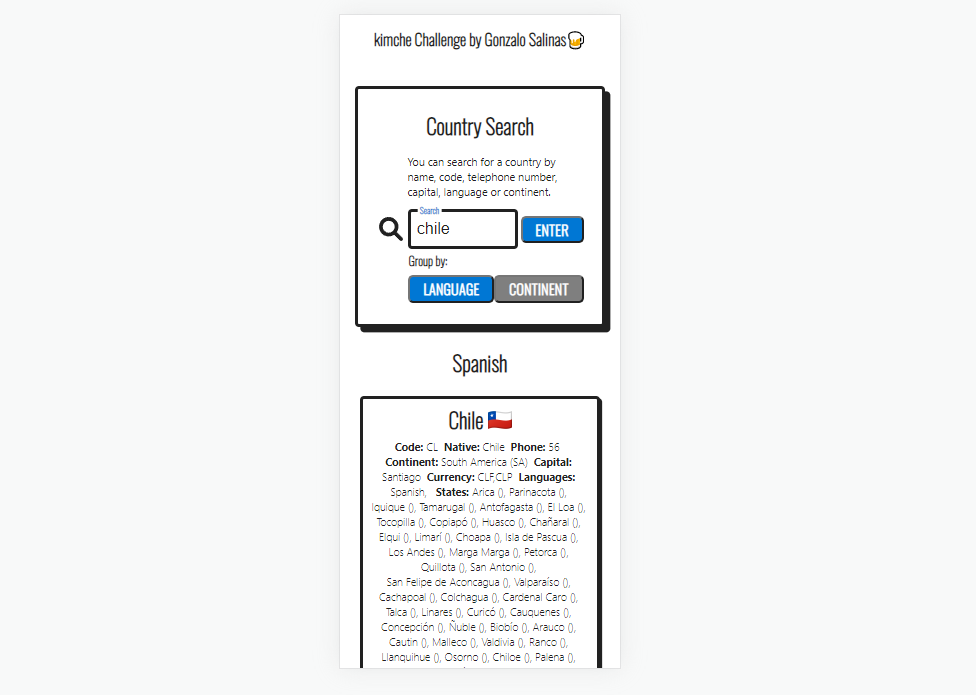

# Desafío para Software Engineers

Nombre postulante: Gonzalo Salinas Campos.:\
Link a la app en producción: [LINK DEL DEPLOY]

## Observaciones

Como comentarios generales del desafío, debo decir que me pareció bastante entretenido de desarrollar a pesar de su aparente simpleza, sobre todo porque debí utilizar librerías que nunca había usado antes con React y la utilización de graphql/apolloclient los cuales son nuevos para mí, pero, aun así, me encantaron estas tecnologías y creo que las seguiré utilizando en el futuro. Tardé en terminar de desarrollar un poco más de lo que pensé por el hecho de trabajar con cosas nuevas para mí, dediqué 3 días de trabajo efectivo.:\
En cuanto a detalles visuales, decidí basarme en una plantilla de libre acceso la cual rescaté de la web (esta citada en src\components\styles\searchCard.scss) y modifiqué lo que consideré necesario. Traté de ajustar todo para que se viera lo más integrado y estético posible. La app es full responsive. Para mostrar las cartas o tarjetas de cada país utilicé una librería llamada “masonry”, la cual crea un grid bastante llamativo y práctico para mostrar imágenes o cards, me ayudó para ahorrar código, tiempo y, ¡Aprendí algo nuevo :D!:\
En cuanto a funcionalidad, agregué un botón para realizar las búsquedas sin quitar la posibilidad de presionar “Enter” del teclado, personalmente me gusta tener ambas opciones y siento que puede ser cómodo para los usuarios. Adicionalmente, agregué el botón de búsqueda para evitar que con cada ingreso del teclado se filtren los datos, ya que esto provocaría una carga de procesamiento muy elevada de la app.

## Pregunta abierta 

La tabla que contiene la información correspondiente a la asistencia diaria de un niño en un colegio tiene 90 millones de filas. Todas las tablas del sistema existen en la misma BDD en MySQL. La lógica del backend que actualiza la información correspondiente al pasar la asistencia tiene un tiempo de servicio p95 de 10 segundos. El equipo está interesado en bajar este tiempo para mejorar la experiencia del usuario (y porque nos gusta pensar en Kimche como un Ferrari). ¿Qué propondrías para enfrentar el problema? Esta pregunta es abierta, no hay respuestas malas. Puedes proponer arquitectura, tecnologías, diseño, etc.:\

### Respuesta

```
En primer lugar, y en la situación hipotética de que el cambio de arquitectura sea inviable (costo, inversión de tiempo, hh, perjudicar compatibilidades entre backends y controlador de BDD, entre otros.) propondría la utilización de índices, el indexar una tabla o la vista es sin lugar a dudas, una de las mejores opciones de poder mejorar el rendimiento de las consultas y aplicaciones en MysQL. En el caso de que el cambio de arquitectura sea viable, propondría la integración de GraphQL, ya que este está desarrollado por el equipo Facebook con el objetivo de trabajar con volúmenes de datos extremadamente grandes, además, puede integrar datos de cualquier tipo de backend en una capa de GraphQL, lo que hace que esta ventaja sea accesible para cualquier tipo de proyecto (incluido mySQL). PD: Ese si que es un niño responsable.
```

## Capturas de la APP




## Herramientas principales

```
react: ^16.13.1
graphql: 14.0.0
apollo-boost": ^0.4.9
```

# Instrucciones

Debes crear un buscador de países consultando el [siguiente grafo](https://countries.trevorblades.com/). Este código contiene una base para seguir con la aplicación en React y ApolloClient. Queda a disposición tuya cualquier cambio, ya sea de estructura, estilo, etc.

Se espera que logres hacer una aplicación parecida a la del siguiente diagrama:


La funcionalidad y estructura debe ser igual, pero el diseño y variantes (por ejemplo, cambiar colores de las cosas) queda a tu gusto. **Considerar que el ícono al lado del nombre de cada país es el emoji**.

Además de esto, se espera que hagas deploy de tu app en el servicio que desees (Heroku, Netlify, AWS, Github Pages, etc).

## Consideraciones

- Se espera que uses buenas prácticas como gitflow (pull requests y commits), orden del código, estructura, eficiencia, etc.
- Puedes dejar comentarios de decisiones que tuviste que tomar y del por qué en este repositorio.
- Se va a considerar un buen diseño de UX/UI.

## Hints

Acá van algunas cosas que pueden ser útiles (o no 👀):

- [Gitignore](https://www.toptal.com/developers/gitignore)
- [GraphQL](https://www.howtographql.com/)
- [React](https://es.reactjs.org/)
- [Styled components](https://styled-components.com/docs/basics)
- [ApolloClient](https://www.apollographql.com/docs/react/)
- [Lodash](https://lodash.com/)
- [Conventional commits](https://www.conventionalcommits.org/en/v1.0.0/)
- [Commitlint](https://commitlint.js.org/#/)
- [Eslint](https://eslint.org/)
- [Eslint airbnb](https://www.npmjs.com/package/eslint-config-airbnb)
- [Husky](https://www.npmjs.com/package/husky)

