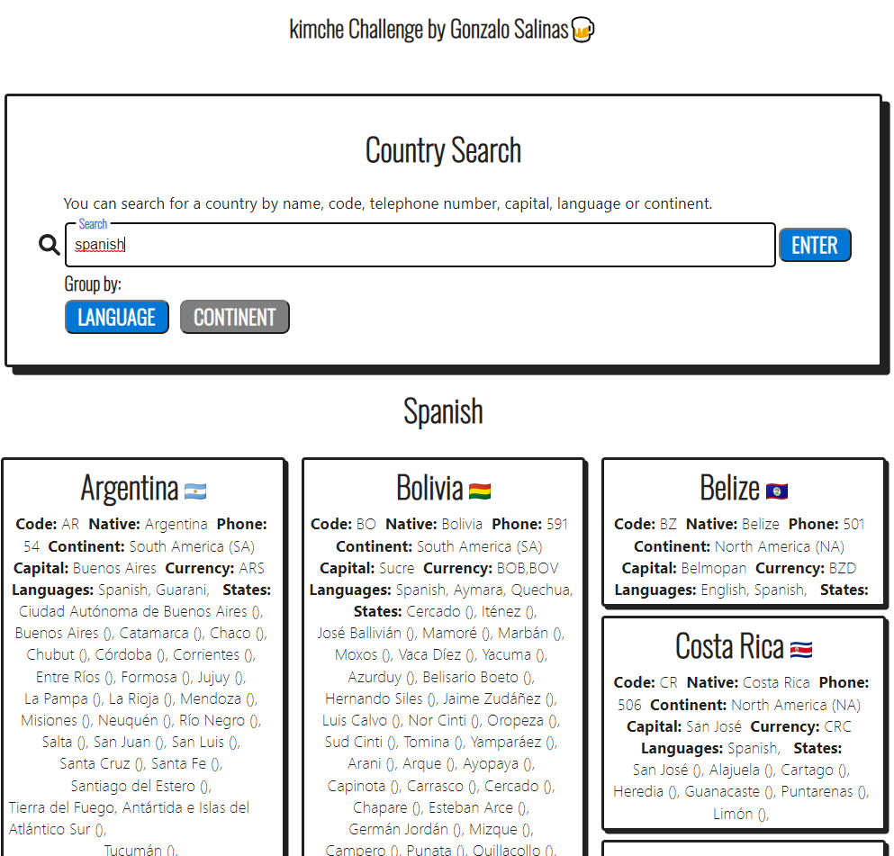

# Desafío para Software Engineers

deploy: 

## Capturas de la APP




## Herramientas principales

```
react: ^16.13.1
graphql: 14.0.0
apollo-boost": ^0.4.9
```

# Instrucciones

Debes crear un buscador de países consultando el [siguiente grafo](https://countries.trevorblades.com/). Este código contiene una base para seguir con la aplicación en React y ApolloClient. Queda a disposición tuya cualquier cambio, ya sea de estructura, estilo, etc.

Se espera que logres hacer una aplicación parecida a la del siguiente diagrama:


La funcionalidad y estructura debe ser igual, pero el diseño y variantes (por ejemplo, cambiar colores de las cosas) queda a tu gusto. **Considerar que el ícono al lado del nombre de cada país es el emoji**.

Además de esto, se espera que hagas deploy de tu app en el servicio que desees (Heroku, Netlify, AWS, Github Pages, etc).

## Consideraciones

- Se espera que uses buenas prácticas como gitflow (pull requests y commits), orden del código, estructura, eficiencia, etc.
- Puedes dejar comentarios de decisiones que tuviste que tomar y del por qué en este repositorio.
- Se va a considerar un buen diseño de UX/UI.
